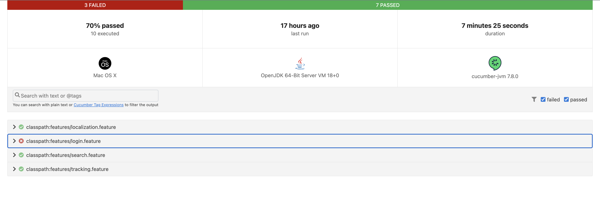

# Test Automation Framework for FeDex

- Example Test Automation Framework
    * [Overview](#overview)
        + [Requirements](#requirements)
        + [Project architecture](#architecture)
        + [Report](#report)
        + [Test scenarios](#scenarios)
        + [Additional info](info)

## Overview
The project has been developed with java. It is a BDD project written by using Cucumber

###Requirements
- Java JDK 18 or higher
- Maven 3.8.5 or higher

## Project architecture

The project is a combination of the Cucumber and POM models. It has locators and page actions in page classes and also there are step-definition classes to define the behavior of the application so as that create the test scenarios. So you can define the behavior (Steps) based on the page classes.

Also, it provides execution of the project on all browsers. You can define the default browser on the[config.properties](https://github.com/serhatozdursun/com.fedex.test/blob/master/src/test/resources/config.properties) file. If you want to run it with a different browser you can define the browser like below. 

``mvn test -Dbrowser=Safari``

it provides to support just Chrome, Firefox and Safari for now. You can add other browsers with adding new browser implementation under the browser package

## Report

I've used the cucumber report, it generates the reports under the [reports'](https://github.com/serhatozdursun/com.fedex.test/tree/master/reports/) directory. It generates two types of reports, an HTML and a JSON report. If a failure occurs, it will take a screenshot, if the scanner is still working. So it will add that screenshot to the HTML report
 
 
 

## Scenarios
There are ten scenarios in for different feature files.

- [localization.feature](https://github.com/serhatozdursun/com.fedex.test/blob/master/src/test/resources/features/localization.feature): is about localization behaviors of page. it has 1 scenario.
- [login.feature](https://github.com/serhatozdursun/com.fedex.test/blob/master/src/test/resources/features/login.feature): is about login sign-in operations. There are 4 scenario in it.
   + Invalid password
   + Successful Login
   + Invalid user id 

the above do get errors sometimes. the page says "We are having trouble establishing a connection. 
Please refresh the page." It maybe comes from a bot protection of the page.
I've left these scenarios as they are, so you can evaluate if they are a real problem.

- [search.feature](https://github.com/serhatozdursun/com.fedex.test/blob/master/src/test/resources/features/search.feature): is about search box on home page. it has 2 scenarios
- [tracking.feature](https://github.com/serhatozdursun/com.fedex.test/blob/master/src/test/resources/features/tracking.feature): is about tracking the shipment. it has 3 scenarios

## Additional info
Calculates static wait time and shows information about it at the end of execution. So we will know about the static cooldown and once it gets that big we can take action to avoid unnecessary waiting times.